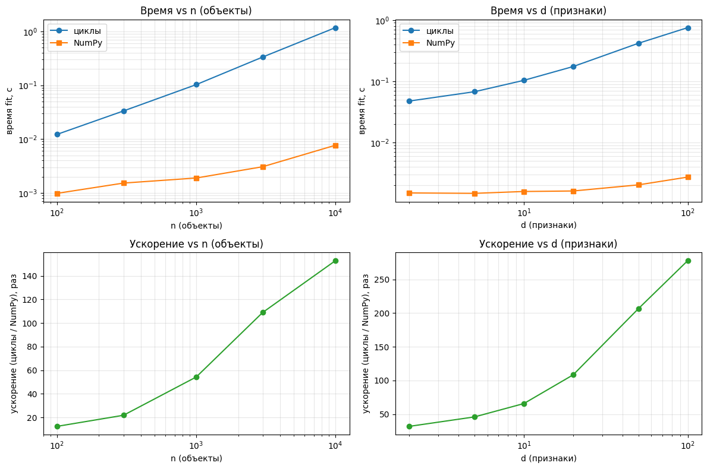

# svlearn 🚀

A machine learning project implemented from scratch with NumPy. It is educational: the goal is to understand the mathematics and inner workings of classic ML algorithms.

It has two parts:

* **Notebooks:** 10+ classic algorithms derived and implemented from scratch (`notebooks/algorithms.ipynb`), plus a guide to the underlying math (`THEORY.md`) and to evaluation metrics.
* **`svlearn` package:** the core models rewritten as a typed library with a `scikit-learn`-like API (`fit` / `predict`).

## `svlearn` package: models

| Model | Module | Notes |
|---|---|---|
| Linear regression | `svlearn.linear_model` | batch gradient descent, fully vectorized |
| Logistic regression | `svlearn.linear_model` | batch gradient descent, fully vectorized |
| K-nearest neighbors | `svlearn.neighbors` | distances vectorized per query; loop over test points |
| Decision tree | `svlearn.tree` | entropy / information gain, recursive; split search is loop-based |
| Random forest | `svlearn.ensemble` | bootstrap + majority vote over custom decision trees |

The remaining algorithms live in `notebooks/algorithms.ipynb` and have not been ported to the package yet.

## ✨ Key features

* **Theory next to code:** each model is written to follow its formulas directly, so the connection between math and implementation stays visible (see `THEORY.md`).
* **Strict static typing:** Python 3.12 syntax, `pyright` in `strict` mode, `jaxtyping` + `numpy.typing` annotations for array shapes.
* **Runtime shape checks:** public `fit` / `predict` / `predict_proba` are decorated with `@jaxtyped(typechecker=beartype)`, so mismatched shapes (e.g. `X` with 50 rows and `y` with 49) raise a `TypeCheckError` instead of silently computing something wrong.
* **Clean architecture:** a shared `BaseEstimator` with unified `fit` / `predict` interfaces.
* **Modern tooling:** `uv` for environments, `ruff` for linting and formatting, `pyright` for type checking.

## 📦 Installation

Python 3.12+ and [`uv`](https://docs.astral.sh/uv/) are required.

```bash
git clone https://github.com/artyomsavov/savkit-learn.git
cd savkit-learn
uv sync --group dev
```

Run examples and notebooks from the repository root (or its subfolders with the project's `.venv` selected as the Jupyter kernel).

## 🚀 Quick start

```python
import numpy as np
from svlearn.linear_model import LogisticRegression
from svlearn.ensemble import RandomForest

# Synthetic dataset
X = np.random.randn(100, 5)
y = np.random.randint(0, 2, size=100)  # tree-based models expect non-negative integer labels

# 1. Logistic regression
log_reg = LogisticRegression(lr=0.01, n_iters=500)
log_reg.fit(X, y)
predictions = log_reg.predict(X)

# 2. Random forest
rf = RandomForest(n_trees=10, max_depth=10)
rf.fit(X, y)
rf_predictions = rf.predict(X)
```

Shape errors are caught at call time:

```python
log_reg.fit(X, y[:-1])  # TypeCheckError: X and y disagree on the number of samples
```

## ⚡ Benchmark: vectorized vs pure-Python loops

`notebooks/vectorized_vs_loops_logreg.ipynb` compares `svlearn.LogisticRegression` (NumPy) with an equivalent implementation on **plain Python lists** (`for` loops, `math.exp`, no NumPy in the hot path). The algorithm, initialization and formulas are identical; weights and predictions of both versions are checked to match (differences ~1e-17).

Setup: `fit` only, 50 gradient-descent iterations, synthetic binary data, best of several runs, one machine.



**Scaling with the number of samples** (d = 10):

| n | NumPy, s | loops, s | speedup |
|---:|---:|---:|---:|
| 100 | 0.00098 | 0.01225 | 12.5× |
| 300 | 0.00153 | 0.03333 | 21.9× |
| 1 000 | 0.00190 | 0.10286 | 54.3× |
| 3 000 | 0.00307 | 0.33426 | 108.9× |
| 10 000 | 0.00769 | 1.17580 | 152.8× |

**Scaling with the number of features** (n = 1000):

| d | NumPy, s | loops, s | speedup |
|---:|---:|---:|---:|
| 2 | 0.00149 | 0.04742 | 31.8× |
| 5 | 0.00147 | 0.06733 | 45.9× |
| 10 | 0.00157 | 0.10335 | 65.7× |
| 20 | 0.00160 | 0.17379 | 108.4× |
| 50 | 0.00202 | 0.41715 | 206.7× |
| 100 | 0.00271 | 0.75215 | 278.0× |

The loop version grows roughly linearly with `n`. NumPy grows much more slowly: at small sizes its time is dominated by per-call overhead rather than arithmetic, which is why the speedup keeps increasing with both `n` and `d`. The speedup is therefore not a constant; it depends on problem size.

## ⚠️ Limitations

* Within the `svlearn` package, only linear and logistic regression are fully vectorized. KNN loops over test points, and the decision tree searches splits with Python loops, so tree-based models are not meant to compete on speed.
* The benchmark covers `fit` of logistic regression only, on one machine and one synthetic dataset.
* The package has no automated test suite yet.
* The goal is clarity and correctness of the implementations, not production performance.

## 📝 Documentation & notebooks

1. **`THEORY.md`**: mathematical guide to the 10+ implemented algorithms: core concepts, loss functions and optimization.
2. **`notebooks/algorithms.ipynb`**: step-by-step translation of the math into from-scratch NumPy code for 10+ algorithms.
3. **`notebooks/metrics.ipynb`**: formulations of the main regression, classification and clustering metrics.
4. **`notebooks/vectorized_vs_loops_logreg.ipynb`**: the vectorization benchmark described above.

## 🛠️ Project structure

```text
savkit-learn/
├── docs/
│   └── benchmark.png       # benchmark plots
├── notebooks/
│   ├── algorithms.ipynb
│   ├── metrics.ipynb
│   └── vectorized_vs_loops_logreg.ipynb
├── svlearn/
│   ├── __init__.py
│   ├── base.py             # BaseEstimator and shape-annotated type aliases
│   ├── linear_model/       # linear.py, logistic.py
│   ├── neighbors/          # knn.py
│   ├── tree/               # decision_tree.py
│   └── ensemble/           # random_forest.py
├── pyproject.toml          # uv, ruff, pyright configuration
├── README.md
└── THEORY.md
```

## 🔧 Code quality

```bash
uv run ruff check .      # linting
uv run ruff format .     # formatting
uv run pyright           # static type checking (strict)
```

